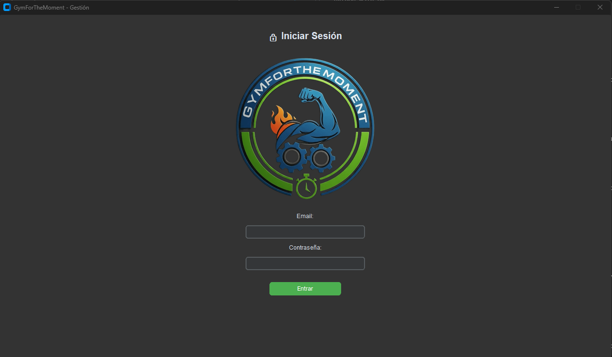
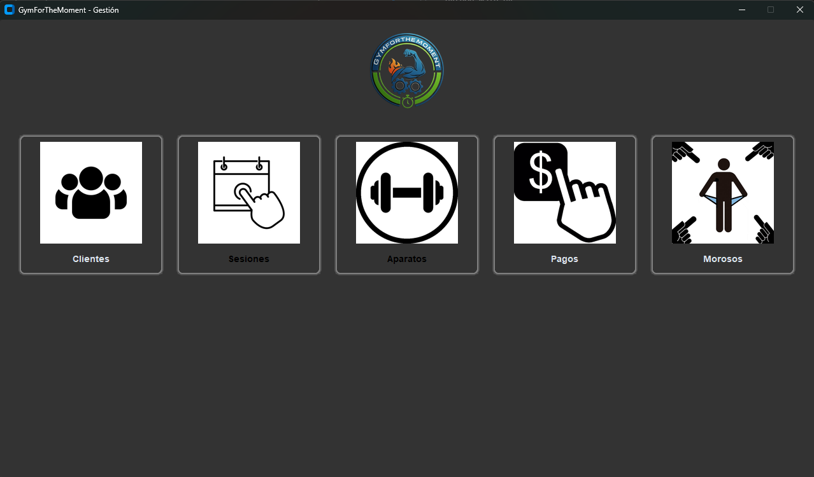
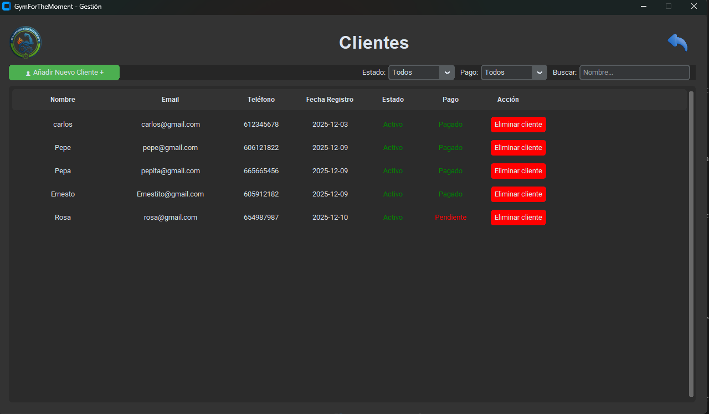
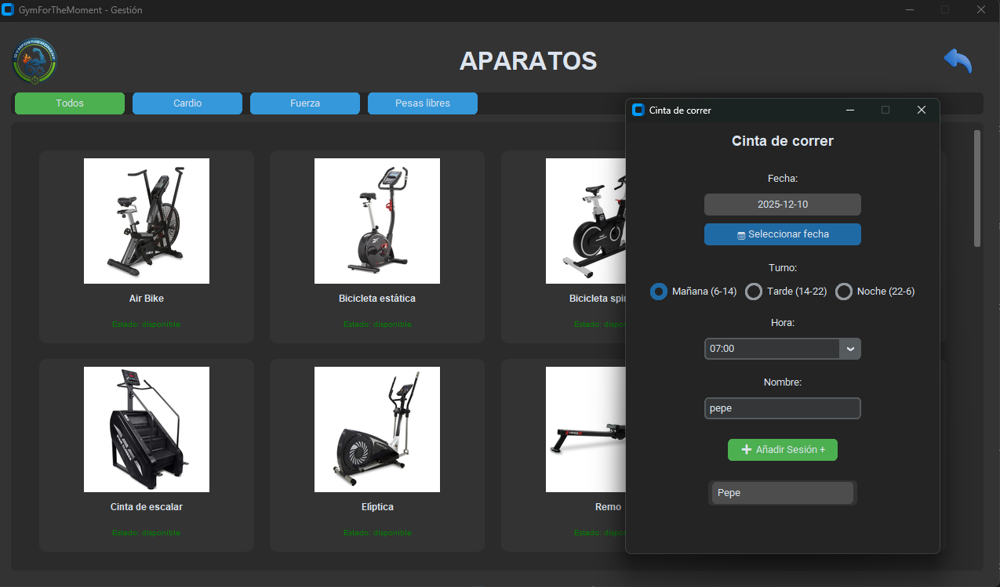
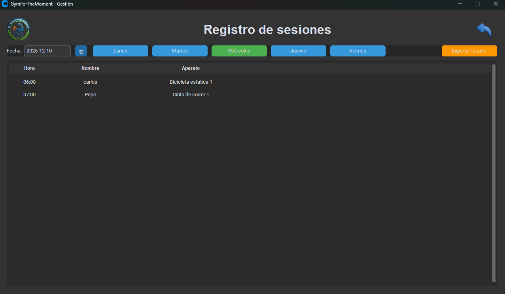
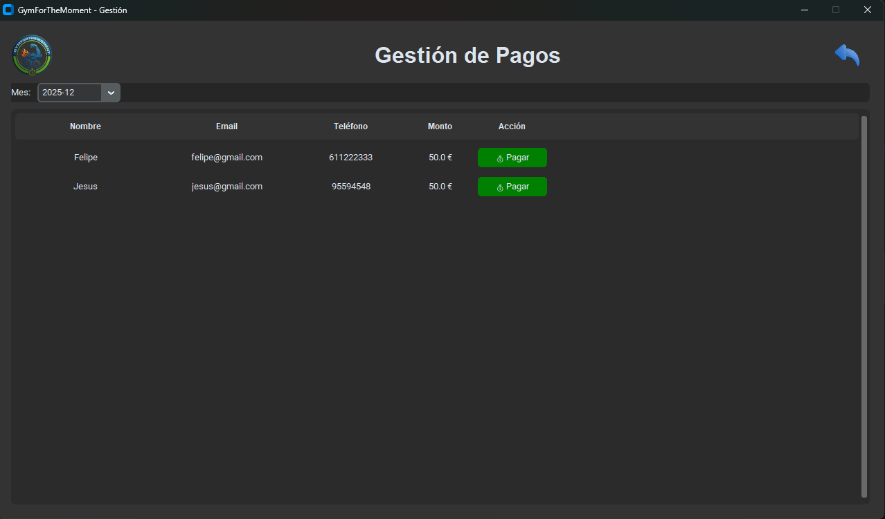
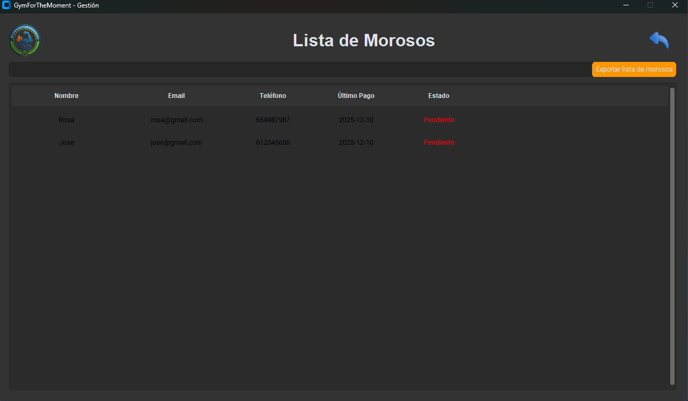

# Sistema de Gestión de Gimnasio - GymForTheMoment

## Descripción del Proyecto

Este aplicativo ha sido desarrollado como proyecto de clase para el Grado de DAM (Desarrollo de Aplicaciones Multiplataforma). El objetivo es proveer una herramienta de gestión eficiente para el personal de mostrador del gimnasio "GymForTheMoment", facilitando el control de clientes, reservas de aparatos y gestión de pagos.

El gimnasio opera 24 horas al día de lunes a viernes y ofrece un sistema novedoso de reserva de aparatos por sesiones de media hora. Además, se gestiona el cobro de mensualidades fijas.

### Características Principales

*   **Gestión de Clientes:** Altas, bajas y listado de clientes con filtros por estado (activo/inactivo) y pago (pendiente/pagado).
*   **Gestión de Aparatos:** visualización y reserva de máquinas de entrenamiento (Cardio, Fuerza, Peso libre).
*   **Reservas y Sesiones:** Control de disponibilidad de aparatos y generación de agenda diaria con opción a exportar en PDF.
*   **Control de Pagos:** Gestión de mensualidades y listado de morosos con exportación a PDF.
*   **Interfaz Gráfica:** Desarrollada en Python con CustomTkinter para una experiencia de usuario moderna y amigable.
*   **Arquitectura MVC:** El proyecto sigue el patrón Modelo-Vista-Controlador para una estructura ordenada y mantenible.

---

## Estructura del Proyecto

El proyecto se organiza bajo el patrón MVC (Modelo-Vista-Controlador):

*   **Model:** Contiene las clases que representan las entidades del sistema (ej. Cliente, Sesion, Aparato, Admin) y la lógica de datos.
*   **View:** Contiene las vistas desarrolladas con `customtkinter`. La vista principal `app` gestiona la navegación entre las diferentes secciones sin abrir múltiples ventanas.
*   **Controller:** Gestiona la interacción entre las vistas y el modelo, incluyendo las operaciones CRUD con la base de datos `gymforthemomentDB.db`.
*   **Resources:** Carpeta para recursos adicionales.
*   **ImagenesEjemplo:** *Contendrá las capturas de pantalla del aplicativo.*

---

## Requisitos Funcionales

La aplicación cubre los siguientes requerimientos del negocio:

1.  **Login de Administradores:** Acceso seguro mediante usuarios predefinidos.
2.  **Registro de Clientes:** Alta de nuevos socios y mantenimiento de sus datos.
3.  **Reserva de Sesiones:**
    *   Duración fija de 30 minutos por sesión.
    *   Validación de disponibilidad para evitar conflictos de horario en el mismo aparato.
    *   Visualización de ocupación por día.
4.  **Gestión de Pagos:**
    *   Generación automática de recibos mensuales (estado pendiente al inicio de mes).
    *   Registro de pagos realizados en mostrador.
    *   Identificación y listado de clientes morosos.
5.  **Exportación de Informes:** Generación de archivos PDF para listas de sesiones diarias y listados de morosos.

---

## Instalación y Ejecución

### Requisitos de Instalación

El proyecto requiere **Python 3.x** instalado en el sistema.

### Instalación de Dependencias

Para ejecutar el proyecto, es necesario instalar las librerías externas listadas en `requirements.txt`. Abre una terminal en la carpeta raíz del proyecto y ejecuta:

```bash
pip install -r requirements.txt
```

Este comando instalará las siguientes librerías esenciales:

*   **customtkinter (5.2.2):** Framework UI moderno para Python basado en Tkinter.
*   **CTkMessagebox (2.6):** Librería para mostrar cuadros de diálogo y mensajes emergentes personalizados.
*   **tkcalendar (1.6.1):** Widget de calendario para la selección intuitiva de fechas en las reservas.
*   **reportlab (4.2.5):** Motor para la generación dinámica de archivos PDF (listados y reportes).
*   **Pillow (10.4.0):** Librería de procesamiento de imágenes (PIL Fork), necesaria para gestionar las imágenes de los aparatos.

### Ejecución

Para iniciar la aplicación, ejecuta el archivo `main.py` desde la terminal o tu IDE favorito:

```bash
python main.py
```

---

## Guía de Uso del Aplicativo

### 1. Login
Al iniciar la aplicación, se presentará el login para acceder con las credenciales de administrador (definidas en la clase `Admin`).

**Usuarios por defecto:**
*   **Usuario:** ana@gym.com // carlos@gym.com // lucia@gym.com
*   **Contraseña:** ana123 // carlos123 // lucia123



### 2. Menú Principal
Una vez dentro, verás el menú de navegación que te permite acceder a todas las funcionalidades.



### 3. Clientes
En esta sección puedes registrar nuevos clientes y consultar el listado existente.
*   **Filtros:** Busca por estado (Activo/Inactivo) o estado de pago.
*   **Buscador:** Encuentra clientes rápidamente por nombre.
*   **Gestión:** Opción para eliminar registros.



### 4. Aparatos y Reservas
Muestra el catálogo de máquinas (Filtros: Cardio, Fuerza, Peso Libre).
*   **Hacer Reserva:** Haz clic en una máquina para abrir la ventana de reserva. Selecciona fecha, hora y cliente para confirmar.



### 5. Sesiones
Consulta la agenda diaria de reservas.
*   **Navegación:** Botones para cambiar entre los días de la semana y selector de fecha.
*   **Exportar:** Genera un PDF con las sesiones del día seleccionado.



### 6. Pagos
Listado de clientes con pagos pendientes.
*   **Ciclo de Pagos:** A principio de mes, todos los clientes activos pasan automáticamente a "Pendiente".
*   **Confirmar Pago:** Marca un pago como realizado cuando el cliente abone su mensualidad.



### 7. Morosos
Sección para el control de deudas.
*   Lista todos los clientes que no han abonado la mensualidad.
*   Permite exportar el listado a PDF para seguimiento.


