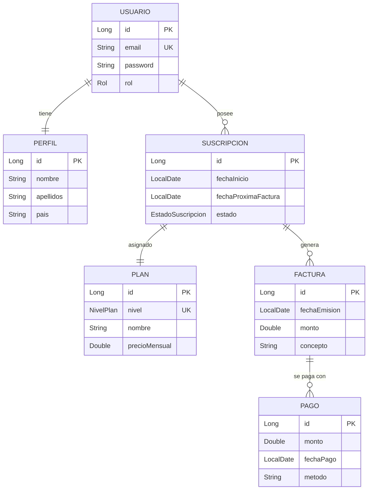

# Plataforma SaaS - Gestión de Suscripciones y Facturación

Este proyecto es una aplicación SaaS completa desarrollada con **Spring Boot 3**, diseñada para gestionar usuarios, planes de suscripción, facturación automática con impuestos y auditoría de cambios.

## 🚀 Características Principales

- **Seguridad y Roles**: Sistema de autenticación con Spring Security. Roles diferenciados: `ADMIN` y `CLIENTE`.
- **Gestión de Planes**: Soporte para múltiples niveles de suscripción (BASIC, PREMIUM, ENTERPRISE).
- **Facturación Inteligente**: 
  - Cálculo de impuestos dinámico basado en el país del usuario (España, Francia, USA, etc.).
  - Prorrateo automático al subir de plan.
- **Ciclo de Vida de Suscripciones**: Renovaciones automáticas diarias (`@Scheduled`) y cancelación de servicios.
- **Panel de Auditoría**: Historial completo de cambios en las suscripciones utilizando **Hibernate Envers**.
- **Interfaz Moderna**: Vistas desarrolladas con Thymeleaf, estilizadas con CSS moderno (Glassmorphism en login, navegación responsive).

## 📊 Diagrama Entidad-Relación (E-R)



## 🛠️ Tecnologías Utilizadas

- **Java 21**
- **Spring Boot 3.4.2**
- **Spring Security** (Autenticación y Autorización)
- **Spring Data JPA** (Persistencia)
- **Hibernate Envers** (Auditoría)
- **H2 Database** (Base de datos en memoria para desarrollo/test)
- **Thymeleaf** (Motor de plantillas)
- **JUnit 5 & MockMvc** (Pruebas unitarias e integración)

## 🔑 Credenciales de Acceso (Test)

Al iniciar la aplicación, se crean automáticamente dos usuarios para pruebas:

| Rol | Email | Contraseña |
|-----|-------|------------|
| **Administrador** | `admin@saas.com` | `admin123` |
| **Cliente** | `cliente@saas.com` | `cliente123` |

## ⚙️ Configuración y Ejecución

### 1. Requisitos Previos
- **MySQL (XAMPP)**: Debes tener XAMPP instalado y el servicio MySQL activo.
- **Base de Datos**: Crea una base de datos llamada `PlataformaSaasDB` en tu Localhost MySQL (por ejemplo, vía phpMyAdmin).

### 2. Ejecución
1.  Clonar el repositorio.
2.  Ejecutar con Maven:
    ```bash
    ./mvnw spring-boot:run
    ```
3.  Acceder a `http://localhost:8080`.

## 🆕 Registro de Usuarios
Ahora los usuarios pueden registrarse por sí mismos desde la página de [Registro](http://localhost:8080/register). Al registrarse, se les asigna automáticamente el **Plan Basic** y el rol de **Cliente**.

## 🎨 Nueva Estética Elegante
Se ha implementado una paleta de colores basada en **Slate & Indigo**, buscando una apariencia profesional, limpia y minimalista, ideal para productos corporativos SaaS.
