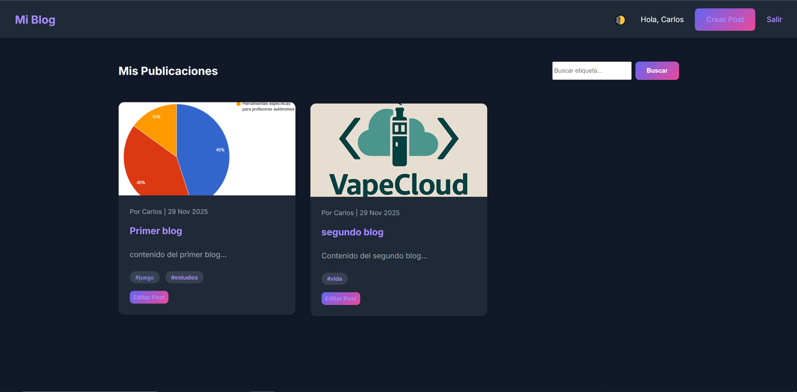
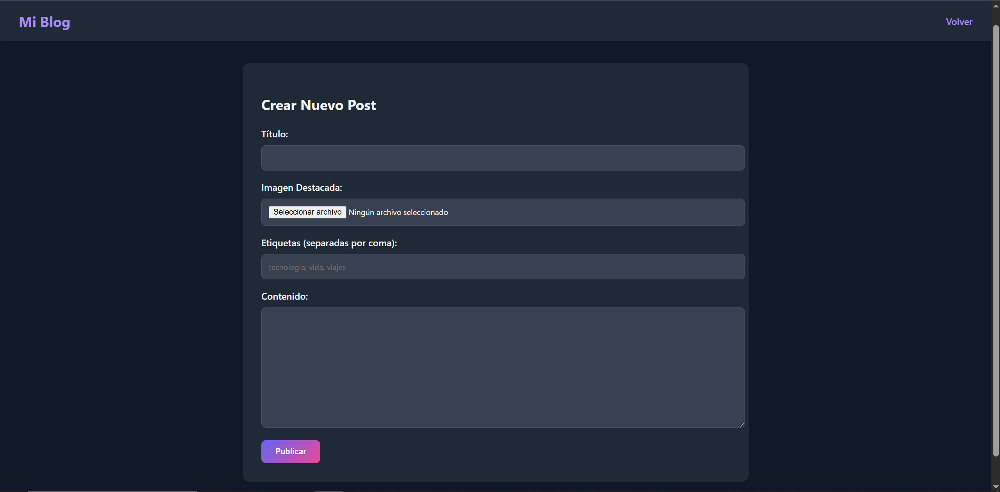
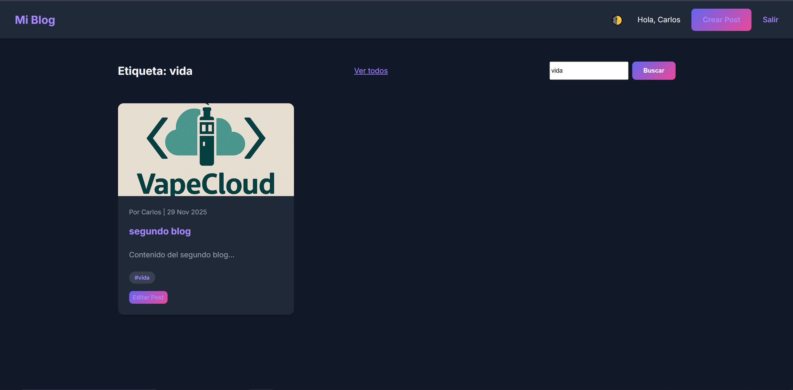
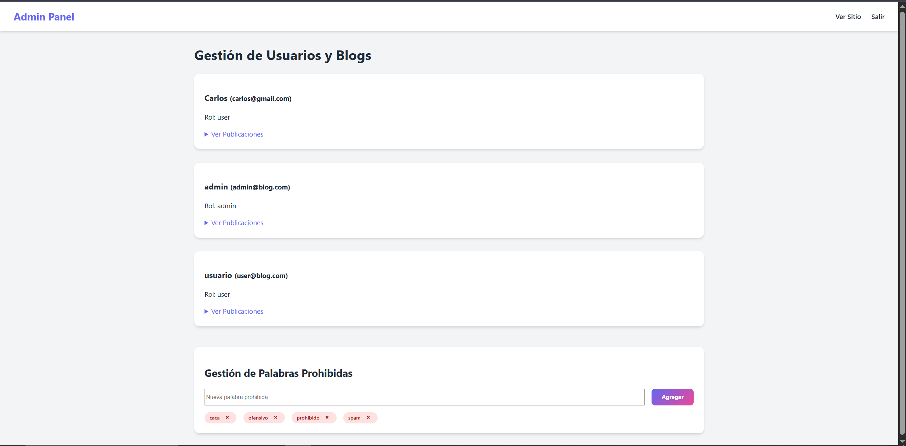
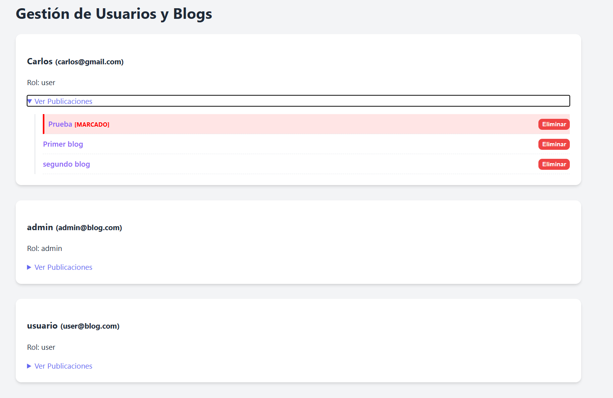

# Blog Personal CMS

Este es un sistema de gestión de contenido (CMS) para un blog personal, desarrollado en PHP nativo con arquitectura MVC.

## 📸 Capturas de Pantalla

### 🏠 Inicio
Aquí tenemos la pantalla de inicio principal una vez iniciado sesión. En esta sección el usuario podrá ver sus post publicados y editarlos, así como crear nuevos post. También dispone de un selector de tema (claro/oscuro).



---

### ✏️ Crear Post
Cuando creemos un nuevo post se nos solicitará un título para el mismo, el contenido del mismo y la posibilidad de añadir etiquetas e imágenes.



---

### 📝 Editar Post
Al editar post nos saldrá una ventana similar a la anterior para poder cambiar el contenido.


---

### 🔍 Búsqueda por Etiquetas
En la sección principal tendremos un buscador de etiquetas, el cual mostrará solo los post con la etiqueta que deseemos.



---

### ⚙️ Panel de Administración
El administrador tendrá una sección única para él en la que aparecerán todos los usuarios. Desde este apartado podrá ver y borrar las publicaciones de los diferentes usuarios. Estos aparecerán ordenados según la fecha de publicación más reciente.

Además de los usuarios, podrá manejar un apartado de "palabras prohibidas".  
Los post que contengan palabras que el administrador haya añadido como prohibidas aparecerán marcados para su revisión y, en caso de ser necesario, borrar dicha publicación.





## Estructura del Proyecto

-   **models/**: Contiene las clases que interactúan con la base de datos (`Usuario`, `Post`, `Etiqueta`) y la conexión (`Conexion.php`).
-   **views/**: Contiene las interfaces de usuario (`Login`, `registro`, `crear post`, `admin`, etc.).
-   **controllers/**: Contiene lógica de control (actualmente solo `logout.php`).
-   **css/**: Archivos de estilo (`styles.css`).
-   **uploads/**: Directorio donde se guardan las imágenes subidas.
-   **index.php**: Punto de entrada principal y listado de blogs.
-   **schema.sql**: Script para crear la base de datos y tablas.

## Configuración

1.  **Base de Datos**:
    -   Crea una base de datos en MySQL llamada `blog_cms` (o usa el script).
    -   Importa el archivo `schema.sql` para crear las tablas y usuarios por defecto.
    -   Configura las credenciales en `models/Conexion.php` si es necesario.

2.  **Usuarios por Defecto**:
    -   Admin: `admin` / `password123`
    -   Usuario: `usuario` / `password123`

## Ejecutar el Servidor

Puedes usar el servidor integrado de PHP para probar la aplicación localmente.

### Iniciar Servidor
Abre una terminal en la carpeta raíz del proyecto y ejecuta:

```bash
php -S localhost:8000
```

Si `php` no está en tu variable de entorno PATH, usa la ruta completa (ejemplo para XAMPP):

```bash
C:\xampp\php\php.exe -S localhost:8000
```

Luego abre tu navegador en: [http://localhost:8000](http://localhost:8000)

### Parar Servidor
Para detener el servidor, ve a la terminal donde se está ejecutando y presiona:
`Ctrl + C`

